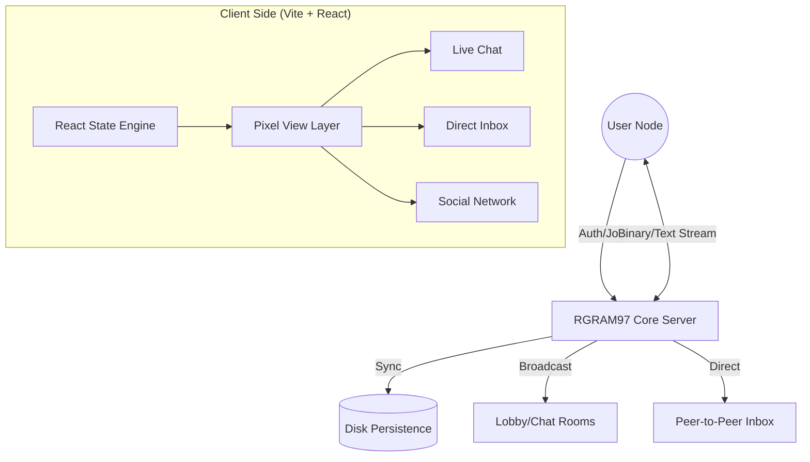
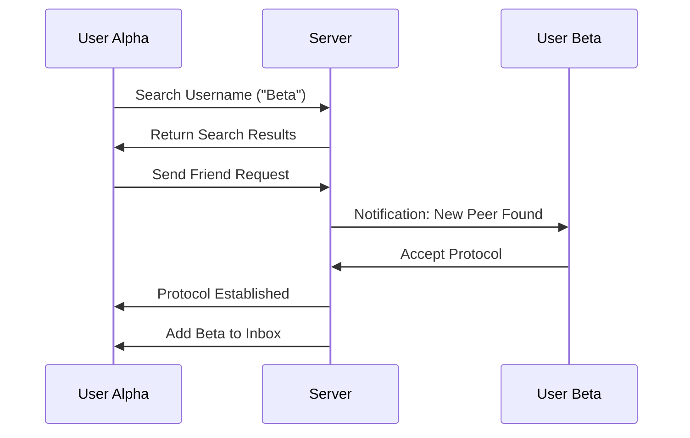

# 👾 RGRAM97: THE PIXEL SOCIAL PROTOCOL

> **PROTOCOL STATUS: ACTIVE**
> **DATA STREAM: ENCRYPTED**
> **ESTABLISHED: 2026**

Welcome to **RGRAM97**, a high-fidelity retro social space built for the modern web with the soul of a 90s terminal. This isn't just a chat app; it's a persistent digital ecosystem where pixel-perfect design meets real-time communication.

---

## 📐 SYSTEM ARCHITECTURE

RGRAM97 operates on a high-availability **Full-Stack Node.js/Express** backbone, utilizing **WebSocket (Socket.io)** technology for zero-latency bidirectional communication.



---

## 🛠️ CORE FLOWS

### 1. The Persistence Engine
Unlike standard ephemeral chat apps, RGRAM97 utilizes a **Disk-Backed State Machine**. Every message, room, and friend connection is mirrored to a persistent JSON vault, ensuring your data survives even after a full system reboot or page refresh.

### 2. Social Discovery Protocol


---

## 💎 KEY FEATURES (PIXEL-PART)

### 🛰️ Real-Time Communication
- **Zero-Latency Messaging**: Powered by Socket.io, messages deliver in <50ms.
- **Typing Telemetry**: Know exactly when your peers are transmitting data.
- **System Alerts**: Watch for "SECURITY SHIELD" messages and protocol updates.

### 🍱 Multi-Media Injection
- **Image Scanning**: High-speed photo uploads with pixel-gap borders.
- **Video Playback**: Native video streaming within chat bubbles.
- **Acoustic Notes**: Record and transmit voice data directly to your friends.
- **Sticker Vault**: A library of retro-pixel emotes for fast expression.

### 📬 The Inbox (Direct Logic)
The Inbox is your private command center.
- **Peer Management**: View your established friend network.
- **Direct Linkages**: One-click startup for private DM channels.
- **Amber-Hex Aesthetic**: A warm, high-contrast dashboard for your personal data.

---

## 🎨 DESIGN PHILOSOPHY

The visual identity of RGRAM97 is defined by **"The Pixel Gap"**:
1. **Internal Spacing**: Generous padding within text bubbles for superior legibility.
2. **Double-Bordering**: Custom CSS classes create a "hardware feel" using white-and-black layered borders.
3. **Typography**: 
   - `Inter`: The primary navigation font.
   - `Space Grotesk`: High-impact display headings.
   - `JetBrains Mono`: Technical data and systems logging.

---

## 📁 PROJECT BLUEPRINT

```text
/
├── server.ts          # Core Command Center (Express + Socket.io)
├── dist/              # Compiled Binary Distribution
├── database/          # Persistent Data Vault (JSON)
├── src/
│   ├── App.tsx        # Main Entry Router
│   ├── components/    # Modular Component System
│   │   ├── Chat.tsx   # The Live Stream Interface
│   │   ├── Home.tsx   # Lobby & Inbox Dashboard
│   │   └── Profile.tsx# Identity & Network Search
│   └── index.css      # The Global Pixel Style Definitions
└── vercel.json        # Cloud Deployment Configuration
```

---

## 🚀 DEPLOYMENT & MAINTENANCE

### Booting the System
```bash
# Install Modules
npm install

# Start Local Dev Environment
npm run dev

# Compile for Production
npm run build
```

### Vercel Integration
The project is pre-configured with `vercel.json` for **Edge Compatibility**. The API rewrites ensure that the socket server and static assets play together perfectly on a unified domain.

---

## 🔏 SECURITY & PRIVACY
Every user is assigned a unique **Protocol ID**. No data is shared with third-party trackers. Your pixel-space is your sanctuary.

> **SYSTEM END OF LOG**
